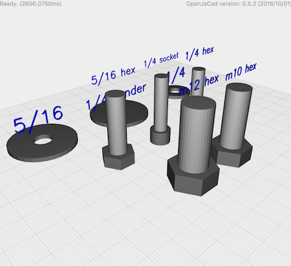
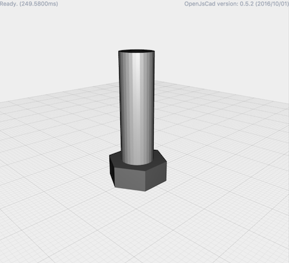

[](https://www.npmjs.org/package/jscad-hardware) [](https://www.npmjs.org/package/jscad-hardware)

# jscad-hardware



This is a collection of jscad parts that model a common Imperial and Metric bolts and washers.  These models use the [jscad-utils](https://github.com/johnwebbcole/jscad-utils) library and return jscad-utils [`group` objects](https://github.com/johnwebbcole/jscad-utils#utilgroupnames-objects--object).


## Installation
Install `jscad-hardware` using NPM:

```bash
npm install --save jscad-hardware
```

## Basic usage
To use the utilities, you need to include the `jscad-hardware.jscad`.

```javascript
include('node_modules/jscad-utils/jscad-utils.jscad');
include('node_modules/jscad-hardware/jscad-hardware.jscad');

main() {
  util.init(CSG);

  var BPlus = RaspberryPi.BPlus();

  return BPlus.combine();
}
```

## Yeoman Generator
You can use the [yeoman jscad generator](https://www.npmjs.com/package/generator-jscad) which will create a project that uses this library.

Once you create your project, install `jscad-hardware`, and run `gulp`.  Dragging the `dist` directory into [http://openjscad.org/](http://openjscad.org/) will include this library.

Modify your `main.jscad` file to return a RaspberryPi object.

```javascript
function main() {
    util.init(CSG);

    var bolt = Hardware.Bolt(
      util.inch(1),
      ImperialBolts['5/16 hex'],
      'close'
    )

    return bolt.combine('head,thread');
}

// include:js
// endinject
```


